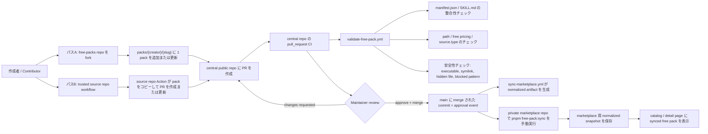

# Context Bank Free Packs

[English](README.en.md) | [日本語](README.ja.md)

この repo は、Context Bank の approved free pack を扱う中央の public repository です。

## 概要

- contributor はこの repo に PR を出して free pack を投稿できます。
- 自分で管理する trusted source repo から、この repo に自動で PR を作ることもできます。
- GitHub Actions は marketplace の本番 secret を使わずに untrusted PR を validation します。
- `merge` が approval event です。
- `merge` 後、private marketplace app 側で `pnpm free-pack:sync` を実行すると、approved pack を取り込めます。

paid pack はこの repo の対象外です。MVP では `source.type = internal_repo` の free pack のみ対応します。

## Source Of Truth Docs

- [Hybrid Submission Strategy](docs/context-bank/00-overview/hybrid-submission-strategy.md)
- [Public Free-Pack Repo Layout](docs/context-bank/02-product/free-pack-repo-layout.md)
- [Free Pack PR Rules](docs/context-bank/06-execution/free-pack-pr-rules.md)
- [Trusted Source Repo Submission](docs/context-bank/06-execution/trusted-source-repo-submission.md)

## フロー図



## 投稿パス

### パス1: 通常の contributor PR

1. この repository を fork します。
2. `packs/<creator>/<slug>/` に対して、ちょうど 1 つの pack directory を追加または更新します。
3. `manifest.json` と `SKILL.md` を含めます。
4. Pull Request を作成します。
5. central repo 側の CI と maintainer review を待ちます。

このパスでは `PAT` は不要です。

### パス2: Trusted source repo automation

1. 別 repository で pack 本体を管理します。
2. source repo 側の workflow を実行します。
3. workflow がこの repo に対する PR を新規作成または更新します。
4. その後の CI と review は通常 PR と同じです。

このパスだけ、GitHub Actions が別 repository に書き込むため source repo 側の secret が必要です。

## ディレクトリ構成

```text
.
├── .github/
│   ├── PULL_REQUEST_TEMPLATE.md
│   └── workflows/
│       ├── submit-from-trusted-source-repo.yml
│       ├── sync-marketplace.yml
│       └── validate-free-pack.yml
├── catalogs/
│   ├── index.json
│   └── latest.json
├── docs/
│   └── context-bank/
├── packs/
│   └── <creator>/
│       └── <slug>/
│           ├── manifest.json
│           ├── SKILL.md
│           ├── knowledge.md
│           ├── data.json
│           ├── examples/
│           ├── prompts/
│           └── assets/
└── scripts/
    ├── build-sync-payload.py
    ├── create-submission-pr.py
    ├── free_pack_common.py
    └── validate-free-pack.py
```

## Contributor Guide

- 1 PR で変更できる pack directory は 1 つだけです。
- free pack のみ対象です。
- executable、symlink、hidden file、危険な prompt / shell content は不可です。
- `manifest.json` と `SKILL.md` は free pricing と category を一致させてください。

推奨ローカル validation:

```bash
printf '%s\n' \
  packs/<creator>/<slug>/manifest.json \
  packs/<creator>/<slug>/SKILL.md \
  > /tmp/changed-files.txt

python3 scripts/validate-free-pack.py \
  --repo-root . \
  --repo-url https://github.com/tigerokuma/context-bank-free-packs \
  --changed-files-file /tmp/changed-files.txt
```

## Maintainer Guide

1. PR が 1 つの pack directory だけを変更しているか確認します。
2. `manifest.json`、`SKILL.md`、変更ファイルを確認します。
3. `pull_request` validation workflow が通っていることを確認します。
4. 問題なければ merge します。squash merge でも構いません。
5. marketplace へ反映したいタイミングで、private marketplace repo 側で `pnpm free-pack:sync` を実行します。

## 現在の MVP 境界

- paid-pack logic は含みません。
- public PR validation では marketplace の本番 secret を使いません。
- この public repo から private app へ直接書き込みません。
- `external_repo` registration flow は未対応です。
- marketplace 反映は post-merge の manual sync 前提です。
