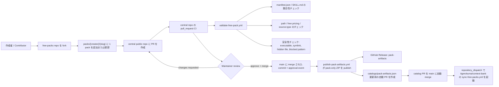

# Context Bank Free Packs

[Read in English](README.md)

この repo は、Context Bank の承認済み free pack を扱う中央の public repository です。

## 概要

- contributor はこの repo に PR を出して free pack を投稿できます。
- contributor は manual に pack を整えてもよいし、AI agent に submission 用の正規化を依頼しても構いません。
- GitHub Actions は marketplace の本番 secret を使わずに untrusted PR を validation します。
- `merge` が approval event です。
- `merge` 後、GitHub Actions が pack-only ZIP を public な `pack-artifacts` release に publish し、`catalogs/pack-artifacts.json` 更新用の自動 PR を作成して自動 merge し、その後 private app repo の sync workflow を自動実行します。

paid pack はこの repo の対象外です。MVP では `source.type = internal_repo` の free pack のみ対応します。

## Source Of Truth Docs

- [Hybrid Submission Strategy](docs/context-bank/00-overview/hybrid-submission-strategy.md)
- [Public Free-Pack Repo Layout](docs/context-bank/02-product/free-pack-repo-layout.md)
- [Free Pack PR Rules](docs/context-bank/06-execution/free-pack-pr-rules.md)
- [Trusted Source Repo Submission](docs/context-bank/06-execution/trusted-source-repo-submission.md)

## フロー図



## 投稿フロー

1. この repository を fork します。
2. `packs/<creator>/<slug>/` に対して、ちょうど 1 つの pack directory を追加または更新します。
3. `manifest.json` と `SKILL.md` を含めます。
4. Pull Request を作成します。
5. central repo 側の CI と maintainer review を待ちます。
6. 承認されれば maintainer が merge します。
7. merge 後、`publish-pack-artifacts.yml` が pack ZIP asset を publish または再利用し、`catalogs/pack-artifacts.json` 更新用の自動 PR を作成または更新します。
8. その catalog PR が check 通過後に自動 merge され、downstream の `tigerokuma/context-bank` sync workflow を自動 dispatch します。

## Agent-First 投稿パス

manual で最終 directory layout を作らなくても、AI agent に submission 用 pack を準備させることができます。

- `AGENTS.md` がこの repo における agent behavior の entry point です。
- contributor が投稿方法、`manifest.json` の生成、`SKILL.md` の修正、任意の local files の pack 化を尋ねたら、agent は `free-pack-submission-prep` skill を使います。
- この skill は、まず local files を inspection し、安全な範囲で metadata を推論して、`packs/<creator>/<slug>/` の canonical structure に変換します。
- ただし最終的な output は従来どおり `scripts/validate-free-pack.py` と通常の PR review を通過する必要があります。

## 既存 Pack の更新方法

以前に approved された pack を更新したい場合も、基本は同じ PR フローです。

1. 同じ pack path を使います: `packs/<creator>/<slug>/`
2. その directory 内の pack ファイルを更新します。
3. metadata が変わるなら `manifest.json` と `SKILL.md` も一緒に更新します。
4. PR を作成します。
5. CI と maintainer review を待ちます。
6. merge 後、その pack directory が変更されていれば、新しい承認済み version が新しい pack-only ZIP として publish されます。

重要ルール:

- 通常の更新では `creator` と `slug` の path を維持してください。
- 通常の update PR で pack directory を勝手に rename / move してはいけません。
- rename / move は maintainer 承認前提の migration PR が必要です。

## ディレクトリ構成

```text
.
├── AGENTS.md
├── .github/
│   ├── PULL_REQUEST_TEMPLATE.md
│   └── workflows/
│       ├── auto-merge-catalog-refresh-pr.yml
│       ├── dispatch-downstream-free-pack-sync.yml
│       ├── submit-from-trusted-source-repo.yml
│       ├── publish-pack-artifacts.yml
│       └── validate-free-pack.yml
├── catalogs/
│   └── pack-artifacts.json
├── docs/
│   └── context-bank/
├── skills/
│   └── free-pack-submission-prep/
│       ├── SKILL.md
│       └── scripts/
│           └── prepare_free_pack_submission.py
├── packs/
│   └── <creator>/
│       └── <slug>/
│           ├── manifest.json
│           ├── SKILL.md
│           ├── knowledge.md
│           ├── data.json
│           ├── examples/
│           ├── prompts/
│           └── assets/
└── scripts/
    ├── build-pack-artifacts.py
    ├── create-submission-pr.py
    ├── free_pack_common.py
    └── validate-free-pack.py
```

## Contributor Guide

- 1 PR で変更できる pack directory は 1 つだけです。
- free pack のみ対象です。
- executable、symlink、hidden file、危険な prompt / shell content は不可です。
- `manifest.json` と `SKILL.md` は free pricing と category を一致させてください。
- agent-assisted prep は可能ですが、commit する最終形は canonical かつ validator-clean である必要があります。

推奨ローカル validation:

```bash
printf '%s\n' \
  packs/<creator>/<slug>/manifest.json \
  packs/<creator>/<slug>/SKILL.md \
  > /tmp/changed-files.txt

python3 scripts/validate-free-pack.py \
  --repo-root . \
  --repo-url https://github.com/tigerokuma/context-bank-free-packs \
  --changed-files-file /tmp/changed-files.txt
```

柔軟な local inputs を canonical pack に変換する helper:

```bash
python3 skills/free-pack-submission-prep/scripts/prepare_free_pack_submission.py \
  --source-dir /path/to/local-files \
  --target-pack-dir packs/<creator>/<slug>
```

## Maintainer Guide

1. PR が 1 つの pack directory だけを変更しているか確認します。
2. `manifest.json`、`SKILL.md`、変更ファイルを確認します。
3. `pull_request` validation workflow が通っていることを確認します。
4. 問題なければ merge します。squash merge でも構いません。
5. merge 後、`publish-pack-artifacts.yml` が成功し、catalog 更新用 PR を作成または更新したことを確認します。
6. その catalog PR が check 通過後に自動 merge されたことを確認します。
7. その merge により downstream の `tigerokuma/context-bank` sync workflow が起動されたことを確認します。manual な downstream sync は fallback / recovery 用です。

この自動 merge フローは、`main` ruleset が生成された catalog PR に人間の approve を必須にしていない前提です。

## Advanced Maintainer Workflow

自分で管理する source repo から、自動で submission PR を作ることもできます。これは `.github/workflows/submit-from-trusted-source-repo.yml` を使う maintainer 向けの上級フローです。

ただし、これは primary contributor path ではありません。通常の contributor は `fork -> pack 更新 -> PR` のフローを使ってください。

## 運用メモ

- 2026-03-09 に作成した PAT-backed GitHub secrets は 2026-06-07 に expire する想定です。
- expiry 前に rotate してください。
- rotate 後は end-to-end automation test を実行してください。

## 現在の MVP 境界

- paid-pack logic は含みません。
- public PR validation では marketplace の本番 secret を使いません。
- この public repo から private app へ直接書き込みません。
- `external_repo` registration flow は未対応です。
- central repo での publish 成功後、catalog 更新用の自動 PR が作成され、その PR が自動 merge された後に downstream sync は自動で起動されます。manual な downstream sync は dispatch や downstream 実行の再試行が必要なときの fallback / recovery 手段です。
