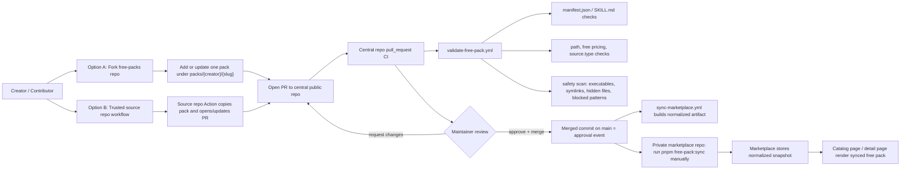

# Context Bank Free Packs

[English](#english) | [日本語](#japanese)

This repository is the public free-pack intake for Context Bank.

<a id="english"></a>

## English

### Overview

This repo is the central public repository for approved free packs.

- Contributors can submit free packs by opening pull requests against this repo.
- Trusted owner-managed source repos can also open or update submission PRs automatically.
- GitHub Actions validate untrusted PRs without marketplace production secrets.
- Merge is the approval event.
- After merge, the private marketplace app can ingest the approved pack by running `pnpm free-pack:sync`.

Paid packs are out of scope here. MVP supports only free packs with `source.type = internal_repo`.

### Source Of Truth Docs

- [Hybrid Submission Strategy](docs/context-bank/00-overview/hybrid-submission-strategy.md)
- [Public Free-Pack Repo Layout](docs/context-bank/02-product/free-pack-repo-layout.md)
- [Free Pack PR Rules](docs/context-bank/06-execution/free-pack-pr-rules.md)
- [Trusted Source Repo Submission](docs/context-bank/06-execution/trusted-source-repo-submission.md)

### Flow Diagram



### Submission Paths

#### Path 1: Standard contributor PR

1. Fork this repository.
2. Add or update exactly one pack directory at `packs/<creator>/<slug>/`.
3. Include both `manifest.json` and `SKILL.md`.
4. Open a pull request.
5. Wait for central repo CI and maintainer review.

No PAT is required for this path.

#### Path 2: Trusted source repo automation

1. Keep the authored pack in another repo you control.
2. Run the source repo workflow.
3. The workflow opens or updates a PR in this repo.
4. Central repo CI and maintainer review still happen here.

This path needs a source-repo secret because GitHub Actions is writing to another repository.

### Directory Layout

```text
.
├── .github/
│   ├── PULL_REQUEST_TEMPLATE.md
│   └── workflows/
│       ├── submit-from-trusted-source-repo.yml
│       ├── sync-marketplace.yml
│       └── validate-free-pack.yml
├── catalogs/
│   ├── index.json
│   └── latest.json
├── docs/
│   └── context-bank/
├── packs/
│   └── <creator>/
│       └── <slug>/
│           ├── manifest.json
│           ├── SKILL.md
│           ├── knowledge.md
│           ├── data.json
│           ├── examples/
│           ├── prompts/
│           └── assets/
└── scripts/
    ├── build-sync-payload.py
    ├── create-submission-pr.py
    ├── free_pack_common.py
    └── validate-free-pack.py
```

### Contributor Guide

- One PR should touch exactly one pack directory.
- Free packs only.
- No executables, symlinks, hidden files, or dangerous prompt/shell content.
- `manifest.json` and `SKILL.md` must agree on free pricing and category.

Recommended local validation:

```bash
printf '%s\n' \
  packs/<creator>/<slug>/manifest.json \
  packs/<creator>/<slug>/SKILL.md \
  > /tmp/changed-files.txt

python3 scripts/validate-free-pack.py \
  --repo-root . \
  --repo-url https://github.com/tigerokuma/context-bank-free-packs \
  --changed-files-file /tmp/changed-files.txt
```

### Maintainer Guide

1. Confirm the PR changes exactly one pack directory.
2. Review `manifest.json`, `SKILL.md`, and the changed file tree.
3. Confirm the `pull_request` validation workflow passed.
4. Merge if approved. Squash merge is acceptable.
5. After merge, run `pnpm free-pack:sync` in the private marketplace repo when you want marketplace visibility to update.

### Current MVP Boundaries

- No paid-pack logic.
- No marketplace production secrets in public PR validation.
- No direct write from this public repo into the private app.
- No `external_repo` registration flow yet.
- Post-merge marketplace reflection is still manual sync.

<a id="japanese"></a>

## 日本語

### 概要

このリポジトリは、Context Bank の free pack を受け付ける中央の public repository です。

- free pack はこの repo への PR で審査されます。
- 自分が管理する trusted source repo から、自動でこの repo に PR を作ることもできます。
- GitHub Actions は marketplace の本番 secret を使わずに validation を行います。
- `merge` が approval event です。
- `merge` 後、private marketplace app 側で `pnpm free-pack:sync` を実行すると catalog / detail に反映できます。

paid pack はこの repo の対象外です。MVP では `source.type = internal_repo` の free pack のみ対応します。

### Source Of Truth Docs

- [Hybrid Submission Strategy](docs/context-bank/00-overview/hybrid-submission-strategy.md)
- [Public Free-Pack Repo Layout](docs/context-bank/02-product/free-pack-repo-layout.md)
- [Free Pack PR Rules](docs/context-bank/06-execution/free-pack-pr-rules.md)
- [Trusted Source Repo Submission](docs/context-bank/06-execution/trusted-source-repo-submission.md)

### フロー図

上の mermaid 図が、以下をまとめて表しています。

- contributor が `fork -> push -> PR` する通常フロー
- trusted source repo から自動で PR を作るフロー
- central repo 側の CI validation
- maintainer review と merge
- merge 後に private app 側の `pnpm free-pack:sync` で marketplace に反映される流れ

### 投稿フロー

#### 1. 通常の contributor フロー

1. この repo を fork します。
2. `packs/<creator>/<slug>/` に 1 pack だけ追加または更新します。
3. `manifest.json` と `SKILL.md` を含めます。
4. PR を作ります。
5. central repo 側の CI と maintainer review を待ちます。

このフローでは `PAT` は不要です。

#### 2. Trusted source repo フロー

1. 別 repo で pack を管理します。
2. source repo 側の workflow を実行します。
3. workflow がこの repo に対して PR を新規作成または更新します。
4. その後の CI と review は通常 PR と同じです。

このフローだけ、別 repo に書き込みを行うため source repo 側に secret が必要です。

### ディレクトリ構成

```text
.
├── .github/
│   ├── PULL_REQUEST_TEMPLATE.md
│   └── workflows/
│       ├── submit-from-trusted-source-repo.yml
│       ├── sync-marketplace.yml
│       └── validate-free-pack.yml
├── catalogs/
│   ├── index.json
│   └── latest.json
├── docs/
│   └── context-bank/
├── packs/
│   └── <creator>/
│       └── <slug>/
│           ├── manifest.json
│           ├── SKILL.md
│           ├── knowledge.md
│           ├── data.json
│           ├── examples/
│           ├── prompts/
│           └── assets/
└── scripts/
    ├── build-sync-payload.py
    ├── create-submission-pr.py
    ├── free_pack_common.py
    └── validate-free-pack.py
```

### Contributor 向けルール

- 1 PR で変更する pack directory は 1 つだけです。
- free pack のみ対象です。
- executable、symlink、hidden file、危険な prompt / shell content は不可です。
- `manifest.json` と `SKILL.md` は category と free pricing を一致させてください。

ローカル validation:

```bash
printf '%s\n' \
  packs/<creator>/<slug>/manifest.json \
  packs/<creator>/<slug>/SKILL.md \
  > /tmp/changed-files.txt

python3 scripts/validate-free-pack.py \
  --repo-root . \
  --repo-url https://github.com/tigerokuma/context-bank-free-packs \
  --changed-files-file /tmp/changed-files.txt
```

### Maintainer 向け運用

1. PR が 1 pack directory だけを触っているか確認します。
2. `manifest.json`、`SKILL.md`、変更ファイルを確認します。
3. `pull_request` validation workflow が通っていることを確認します。
4. 問題なければ merge します。
5. marketplace へ反映したいタイミングで、private marketplace repo 側で `pnpm free-pack:sync` を実行します。

### 現在の MVP 境界

- paid pack のロジックはここに含みません。
- public PR validation では marketplace の本番 secret を使いません。
- この public repo から private app へ直接書き込みません。
- `external_repo` 登録モデルは未対応です。
- marketplace 反映は post-merge の manual sync 前提です。
