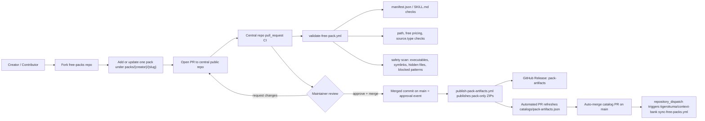

# Context Bank Free Packs

[日本語はこちら](README.ja.md)

This repo is the central public repository for approved free packs in Context Bank.

## Overview

- Contributors submit free packs by opening pull requests against this repo.
- Contributors can either prepare the pack manually or ask an AI agent to do the normalization work first.
- GitHub Actions validate untrusted PRs without marketplace production secrets.
- Merge is the approval event.
- After merge, GitHub Actions publish a pack-only ZIP to the public `pack-artifacts` release, open and auto-merge an automated PR to refresh `catalogs/pack-artifacts.json`, and then trigger the private app repo sync workflow.

Paid packs are out of scope here. MVP supports only free packs with `source.type = internal_repo`.

## Source Of Truth Docs

- [Hybrid Submission Strategy](docs/context-bank/00-overview/hybrid-submission-strategy.md)
- [Public Free-Pack Repo Layout](docs/context-bank/02-product/free-pack-repo-layout.md)
- [Free Pack PR Rules](docs/context-bank/06-execution/free-pack-pr-rules.md)
- [Trusted Source Repo Submission](docs/context-bank/06-execution/trusted-source-repo-submission.md)

## Flow Diagram



## Submission Flow

1. Fork this repository.
2. Add or update exactly one pack directory at `packs/<creator>/<slug>/`.
3. Include both `manifest.json` and `SKILL.md`.
4. Open a pull request.
5. Wait for central repo CI and maintainer review.
6. If approved, the maintainer merges the PR.
7. After merge, the `publish-pack-artifacts.yml` workflow publishes or reuses the pack ZIP asset and opens or updates an automated PR for `catalogs/pack-artifacts.json`.
8. After the catalog PR passes validation, it is merged automatically and the downstream `tigerokuma/context-bank` sync workflow is dispatched.

## Agent-First Submission Path

Contributors can also ask an AI agent to prepare a pack for submission instead of hand-authoring the final directory layout.

- `AGENTS.md` is the repo entry point for agent behavior.
- Agents should use the `free-pack-submission-prep` skill when a contributor asks how to submit, how to generate `manifest.json`, how to fix `SKILL.md`, or how to turn arbitrary local files into a valid pack.
- The skill is allowed to inspect arbitrary local files first, infer metadata, and transform safe inputs into the canonical `packs/<creator>/<slug>/` structure.
- The final output still has to pass `scripts/validate-free-pack.py` and the normal PR review rules.

## Updating An Existing Pack

If you already have an approved pack and want to update it, use the same PR flow.

1. Work in the same pack path: `packs/<creator>/<slug>/`
2. Update the pack files in that directory.
3. Update `manifest.json` and `SKILL.md` together if metadata changed.
4. Open a PR.
5. Wait for CI and maintainer review.
6. After merge, the new approved version is published as a new pack-only ZIP if the pack directory changed.

Important rules:

- Keep the same `creator` and `slug` path for normal updates.
- Do not silently rename or move the pack directory in a regular update PR.
- Renames or moves require an explicit maintainer-approved migration PR.

## Directory Layout

```text
.
├── AGENTS.md
├── .github/
│   ├── PULL_REQUEST_TEMPLATE.md
│   └── workflows/
│       ├── auto-merge-catalog-refresh-pr.yml
│       ├── dispatch-downstream-free-pack-sync.yml
│       ├── submit-from-trusted-source-repo.yml
│       ├── publish-pack-artifacts.yml
│       └── validate-free-pack.yml
├── catalogs/
│   └── pack-artifacts.json
├── docs/
│   └── context-bank/
├── skills/
│   └── free-pack-submission-prep/
│       ├── SKILL.md
│       └── scripts/
│           └── prepare_free_pack_submission.py
├── packs/
│   └── <creator>/
│       └── <slug>/
│           ├── manifest.json
│           ├── SKILL.md
│           ├── knowledge.md
│           ├── data.json
│           ├── examples/
│           ├── prompts/
│           └── assets/
└── scripts/
    ├── build-pack-artifacts.py
    ├── create-submission-pr.py
    ├── free_pack_common.py
    └── validate-free-pack.py
```

## Contributor Guide

- One PR should touch exactly one pack directory.
- Free packs only.
- No executables, symlinks, hidden files, or dangerous prompt/shell content.
- `manifest.json` and `SKILL.md` must agree on free pricing and category.
- Agent-assisted prep is allowed, but the committed result still must be canonical and validator-clean.

Recommended local validation:

```bash
printf '%s\n' \
  packs/<creator>/<slug>/manifest.json \
  packs/<creator>/<slug>/SKILL.md \
  > /tmp/changed-files.txt

python3 scripts/validate-free-pack.py \
  --repo-root . \
  --repo-url https://github.com/tigerokuma/context-bank-free-packs \
  --changed-files-file /tmp/changed-files.txt
```

Agent helper for flexible local inputs:

```bash
python3 skills/free-pack-submission-prep/scripts/prepare_free_pack_submission.py \
  --source-dir /path/to/local-files \
  --target-pack-dir packs/<creator>/<slug>
```

## Maintainer Guide

1. Confirm the PR changes exactly one pack directory.
2. Review `manifest.json`, `SKILL.md`, and the changed file tree.
3. Confirm the `pull_request` validation workflow passed.
4. Merge if approved. Squash merge is acceptable.
5. After merge, confirm `publish-pack-artifacts.yml` succeeded and either updated or created the catalog refresh PR.
6. Confirm the catalog refresh PR was auto-merged after its checks passed.
7. Confirm the catalog PR merge triggered the downstream `tigerokuma/context-bank` sync workflow. Manual downstream sync should be used only for fallback or recovery.

This auto-merge flow assumes the `main` ruleset does not require a human PR approval for the generated catalog PR.

## Advanced Maintainer Workflow

Owner-managed source repos can also open or update submission PRs automatically by using the reusable workflow in `.github/workflows/submit-from-trusted-source-repo.yml`.

This is an advanced maintainer workflow, not the primary contributor path. Standard contributors should use the normal `fork -> update pack -> PR` flow above.

## Operations Note

- PAT-backed GitHub secrets created on 2026-03-09 are expected to expire on 2026-06-07.
- Rotate them before expiry.
- After rotation, run an end-to-end automation test.

## Current MVP Boundaries

- No paid-pack logic.
- No marketplace production secrets in public PR validation.
- No direct write from this public repo into the private app.
- No `external_repo` registration flow yet.
- Automatic downstream sync now starts after the automated catalog-refresh PR is auto-merged into `main`. Manual downstream sync remains fallback or recovery behavior if the dispatch or downstream run needs to be retried.
