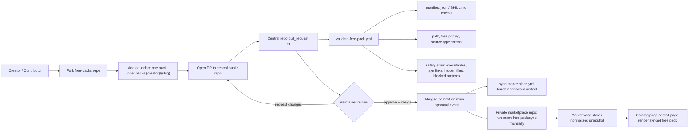

# Context Bank Free Packs

[日本語はこちら](README.ja.md)

This repo is the central public repository for approved free packs in Context Bank.

## Overview

- Contributors submit free packs by opening pull requests against this repo.
- GitHub Actions validate untrusted PRs without marketplace production secrets.
- Merge is the approval event.
- After merge, the private marketplace app can ingest the approved pack by running `pnpm free-pack:sync`.

Paid packs are out of scope here. MVP supports only free packs with `source.type = internal_repo`.

## Source Of Truth Docs

- [Hybrid Submission Strategy](docs/context-bank/00-overview/hybrid-submission-strategy.md)
- [Public Free-Pack Repo Layout](docs/context-bank/02-product/free-pack-repo-layout.md)
- [Free Pack PR Rules](docs/context-bank/06-execution/free-pack-pr-rules.md)
- [Trusted Source Repo Submission](docs/context-bank/06-execution/trusted-source-repo-submission.md)

## Flow Diagram



## Submission Flow

1. Fork this repository.
2. Add or update exactly one pack directory at `packs/<creator>/<slug>/`.
3. Include both `manifest.json` and `SKILL.md`.
4. Open a pull request.
5. Wait for central repo CI and maintainer review.
6. If approved, the maintainer merges the PR.
7. After merge, the marketplace can ingest the approved pack through `pnpm free-pack:sync` in the private app repo.

## Updating An Existing Pack

If you already have an approved pack and want to update it, use the same PR flow.

1. Work in the same pack path: `packs/<creator>/<slug>/`
2. Update the pack files in that directory.
3. Update `manifest.json` and `SKILL.md` together if metadata changed.
4. Open a PR.
5. Wait for CI and maintainer review.
6. After merge, the new approved version becomes available to the marketplace on the next `pnpm free-pack:sync`.

Important rules:

- Keep the same `creator` and `slug` path for normal updates.
- Do not silently rename or move the pack directory in a regular update PR.
- Renames or moves require an explicit maintainer-approved migration PR.

## Directory Layout

```text
.
├── .github/
│   ├── PULL_REQUEST_TEMPLATE.md
│   └── workflows/
│       ├── submit-from-trusted-source-repo.yml
│       ├── sync-marketplace.yml
│       └── validate-free-pack.yml
├── catalogs/
│   ├── index.json
│   └── latest.json
├── docs/
│   └── context-bank/
├── packs/
│   └── <creator>/
│       └── <slug>/
│           ├── manifest.json
│           ├── SKILL.md
│           ├── knowledge.md
│           ├── data.json
│           ├── examples/
│           ├── prompts/
│           └── assets/
└── scripts/
    ├── build-sync-payload.py
    ├── create-submission-pr.py
    ├── free_pack_common.py
    └── validate-free-pack.py
```

## Contributor Guide

- One PR should touch exactly one pack directory.
- Free packs only.
- No executables, symlinks, hidden files, or dangerous prompt/shell content.
- `manifest.json` and `SKILL.md` must agree on free pricing and category.

Recommended local validation:

```bash
printf '%s\n' \
  packs/<creator>/<slug>/manifest.json \
  packs/<creator>/<slug>/SKILL.md \
  > /tmp/changed-files.txt

python3 scripts/validate-free-pack.py \
  --repo-root . \
  --repo-url https://github.com/tigerokuma/context-bank-free-packs \
  --changed-files-file /tmp/changed-files.txt
```

## Maintainer Guide

1. Confirm the PR changes exactly one pack directory.
2. Review `manifest.json`, `SKILL.md`, and the changed file tree.
3. Confirm the `pull_request` validation workflow passed.
4. Merge if approved. Squash merge is acceptable.
5. After merge, run `pnpm free-pack:sync` in the private marketplace repo when you want marketplace visibility to update.

## Advanced Maintainer Workflow

Owner-managed source repos can also open or update submission PRs automatically by using the reusable workflow in `.github/workflows/submit-from-trusted-source-repo.yml`.

This is an advanced maintainer workflow, not the primary contributor path. Standard contributors should use the normal `fork -> update pack -> PR` flow above.

## Current MVP Boundaries

- No paid-pack logic.
- No marketplace production secrets in public PR validation.
- No direct write from this public repo into the private app.
- No `external_repo` registration flow yet.
- Post-merge marketplace reflection is still manual sync.
